# Counterscarp Engine Architecture

A comprehensive visual documentation of the Counterscarp Security Engine's architecture, data flows, and component relationships.

## Table of Contents

1. [System Architecture Overview](#1-system-architecture-overview)
2. [Analysis Pipeline Flow](#2-analysis-pipeline-flow)
3. [Module Dependency Graph](#3-module-dependency-graph)
4. [Exception Hierarchy](#4-exception-hierarchy)
5. [Configuration System](#5-configuration-system)
6. [Execution Profiles Comparison](#6-execution-profiles-comparison)
7. [Data Flow: Finding Lifecycle](#7-data-flow-finding-lifecycle)
8. [Innovative Features Architecture](#8-innovative-features-architecture)

---

## 1. System Architecture Overview

The Counterscarp Engine follows a modular, pipeline-based architecture with a central orchestrator coordinating multiple specialized security analyzers. The system is designed to be extensible, allowing optional analyzers to be integrated based on project requirements.

```mermaid
flowchart TD
    subgraph Interfaces["User Interfaces"]
        CLI["CLI (orchestrator.py)"]
        GUI["GUI (gui.py)"]
    end

    subgraph Orchestrator["Central Orchestrator"]
        ORCH["Orchestrator"]
    end

    subgraph SecurityAnalyzers["Security Analyzers"]
        direction TB
        STATIC["Static Analysis"]
        DYNAMIC["Dynamic Analysis"]
        HEURISTIC["Heuristic Scanner"]
        SOLANA["Solana Analyzer"]
        UPGRADE["Upgrade Diff"]
    end

    subgraph StaticTools["Static Analysis Tools"]
        SLITHER["Slither"]
        ADERYN["Aderyn"]
        MYTHRIL["Mythril"]
    end

    subgraph DynamicTools["Dynamic Analysis Tools"]
        FOUNDRY["Foundry Fuzz"]
        MEDUSA["Medusa"]
    end

    subgraph ThreatIntel["Threat Intelligence"]
        KNOWLEDGE["Knowledge Fetcher"]
        SOLANA_INTEL["Solana Intel"]
        C4["Code4rena"]
        IMMUNEFI["Immunefi"]
        SOLODIT["Solodit"]
        NEODYME["Neodyme"]
        OTTERSEC["OtterSec"]
        SEC3["Sec3"]
    end

    subgraph SupplyChain["Supply Chain"]
        SCC["supply_chain_check"]
        OSV["OSV.dev API"]
    end

    subgraph Innovative["Innovative Features"]
        direction TB
        RAG["RAG Engine"]
        EMB["Embeddings"]
        AG["Attack Graph"]
        VIS["Visualizer"]
        HIST["History Scanner"]
        IDL["IDL Validator"]
        PIPE["Pipeline Gen"]
        FP["Fingerprint"]
        PDB["Protocol DB"]
    end

    subgraph Infrastructure["Core Infrastructure"]
        LOGGER["logger.py"]
        EXCEPTIONS["exceptions.py"]
        CONFIG["config_loader.py"]
        HTTP["http_utils.py"]
    end

    subgraph Reporting["Report Generation"]
        REPORT["report_generator.py"]
        HTML["HTML Reports"]
        MD["Markdown Reports"]
        SARIF["SARIF Reports"]
    end

    subgraph ExternalTools["External Tools"]
        EXT_SLITHER["slither"]
        EXT_ADERYN["aderyn"]
        EXT_MEDUSA["medusa"]
        EXT_MYTH["myth"]
        EXT_FORGE["forge"]
        EXT_OPENAI["OpenAI API"]
        EXT_ANTHROPIC["Anthropic API"]
    end

    CLI --> ORCH
    GUI --> ORCH
    ORCH --> SecurityAnalyzers
    ORCH --> SupplyChain
    ORCH --> ThreatIntel
    ORCH --> Innovative
    ORCH --> Reporting

    STATIC --> SLITHER
    STATIC --> ADERYN
    STATIC --> MYTHRIL

    DYNAMIC --> FOUNDRY
    DYNAMIC --> MEDUSA

    KNOWLEDGE --> C4
    KNOWLEDGE --> IMMUNEFI
    KNOWLEDGE --> SOLODIT

    SOLANA_INTEL --> NEODYME
    SOLANA_INTEL --> OTTERSEC
    SOLANA_INTEL --> SEC3

    SCC --> OSV

    RAG --> EMB
    RAG --> EXT_OPENAI
    RAG --> EXT_ANTHROPIC
    AG --> VIS
    FP --> PDB

    SLITHER --> EXT_SLITHER
    ADERYN --> EXT_ADERYN
    MEDUSA --> EXT_MEDUSA
    MYTHRIL --> EXT_MYTH
    FOUNDRY --> EXT_FORGE

    SecurityAnalyzers -.-> LOGGER
    SecurityAnalyzers -.-> EXCEPTIONS
    SecurityAnalyzers -.-> CONFIG
    ThreatIntel -.-> HTTP
    SupplyChain -.-> HTTP
    Innovative -.-> HTTP
    Innovative -.-> LOGGER
    Innovative -.-> CONFIG
    HTTP -.-> LOGGER
    HTTP -.-> CONFIG

    REPORT --> HTML
    REPORT --> MD
    REPORT --> SARIF


```

---

## 2. Analysis Pipeline Flow

The orchestrator executes a 13-phase sequential pipeline. Each phase can be enabled/disabled via configuration or command-line flags. Optional phases are marked with decision nodes.

```mermaid
flowchart TD
    START(["Start"]) --> DEC0

    DEC0{"RAG?"} -->|Yes| PHASE0
    DEC0 -->|No| PHASE1

    PHASE0["Phase 0: RAG Enrichment"] --> PHASE1

    PHASE1["Phase 1: Supply Chain"] --> PHASE2

    PHASE2["Phase 2: Slither Analysis"] --> DEC2

    DEC2{"Aderyn?"} -->|Yes| PHASE2B
    DEC2 -->|No| DEC3

    PHASE2B["Phase 2B: Aderyn"] --> DEC3

    DEC3{"Foundry?"} -->|Yes| PHASE3
    DEC3 -->|No| DEC4

    PHASE3["Phase 3: Foundry Fuzz"] --> DEC4

    DEC4{"Medusa?"} -->|Yes| PHASE3B
    DEC4 -->|No| DEC4A

    PHASE3B["Phase 3B: Medusa"] --> DEC4A

    DEC4A{"Fingerprint?"} -->|Yes| PHASE3C
    DEC4A -->|No| PHASE4

    PHASE3C["Phase 3C: Fingerprint"] --> PHASE4

    PHASE4["Phase 4: Heuristic Scan"] --> DEC5

    DEC5{"Mythril?"} -->|Yes| PHASE5
    DEC5 -->|No| DEC5A

    PHASE5["Phase 5: Mythril"] --> DEC5A

    DEC5A{"History?"} -->|Yes| PHASE5B
    DEC5A -->|No| DEC6

    PHASE5B["Phase 5B: History Scan"] --> DEC6

    DEC6{"Solana?"} -->|Yes| PHASE6
    DEC6 -->|No| DEC6A

    PHASE6["Phase 6: Solana"] --> DEC6A

    DEC6A{"IDL?"} -->|Yes| PHASE6B
    DEC6A -->|No| DEC7

    PHASE6B["Phase 6B: IDL Validate"] --> DEC7

    DEC7{"Upgrade?"} -->|Yes| PHASE7
    DEC7 -->|No| DEC7A

    PHASE7["Phase 7: Upgrade Diff"] --> DEC7A

    DEC7A{"Attack Graph?"} -->|Yes| PHASE7B
    DEC7A -->|No| PHASE8

    PHASE7B["Phase 7B: Attack Graph"] --> PHASE8

    PHASE8["Phase 8: Report Gen"] --> DEC9

    DEC9{"Full Report?"} -->|Yes| PHASE9
    DEC9 -->|No| END1

    PHASE9["Phase 9: Full Reports"] --> END2

    END1(["Action Plan"])
    END2(["Full Reports"])


```

---

## 3. Module Dependency Graph

This diagram shows the import dependencies between modules. Core infrastructure modules are at the base, with analyzers and interfaces building on top.

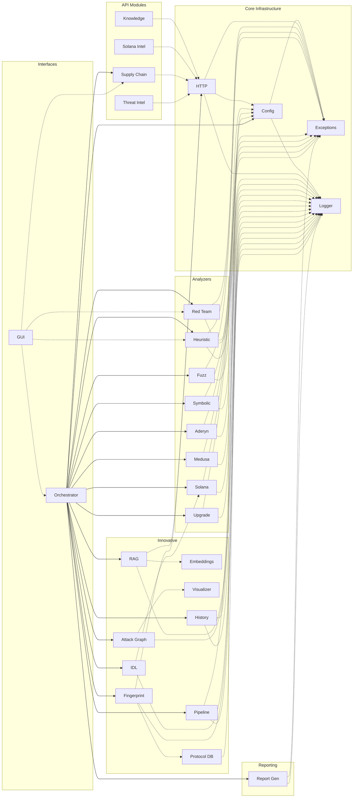

---

## 4. Exception Hierarchy

Counterscarp Engine uses a custom exception hierarchy for structured error handling. All exceptions inherit from `CounterscarfError` and support optional details dictionaries for structured context.

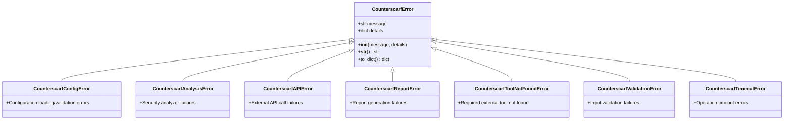

### Exception Usage Examples

| Exception | Usage Context | Example Details |
|-----------|---------------|------------------|
| `CounterscarfConfigError` | Invalid TOML syntax, missing required keys | `{"path": "config.toml", "line": 42}` |
| `CounterscarfAnalysisError` | Slither/Aderyn/Mythril execution failure | `{"tool": "slither", "contract": "Token.sol"}` |
| `CounterscarfAPIError` | OSV.dev, threat intel API failures | `{"api": "osv", "status_code": 503}` |
| `CounterscarfReportError` | HTML/MD/SARIF generation failure | `{"format": "html", "output_path": "/reports"}` |
| `CounterscarfToolNotFoundError` | Missing external tool in PATH | `{"tool": "mythril", "install_cmd": "pip install mythril"}` |
| `CounterscarfValidationError` | Invalid input parameters | `{"field": "address", "value": "0x123"}` |
| `CounterscarfTimeoutError` | Analysis exceeding time limits | `{"operation": "symbolic_analysis", "timeout_seconds": 300}` |

---

## 5. Configuration System

The configuration system uses a layered approach with base configuration and profile-specific overrides. All configuration is validated and loaded into typed dataclasses.

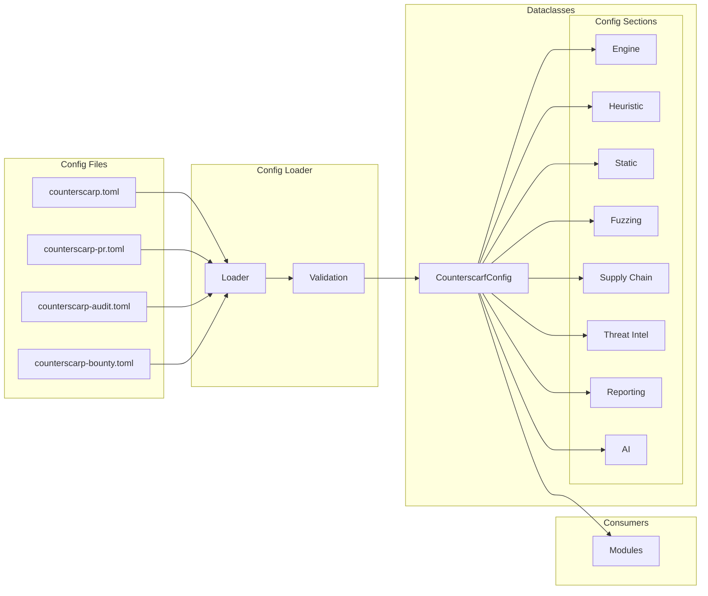

### Configuration Sections Overview

| Section | Dataclass | Purpose |
|---------|-----------|---------|
| `engine` | `EngineConfig` | Engine name, version, fail severity, max findings |
| `heuristics` | `HeuristicConfig` | Heuristic scanner enable/disable, rule overrides |
| `suppressions` | `List[Suppression]` | Finding suppression rules with file/line/expiration |
| `static_analysis` | `StaticAnalysisConfig` | Slither/Aderyn settings, detector filters |
| `fuzzing` | `FuzzingConfig` | Foundry/Medusa settings, runs, timeouts |
| `red_team` | `RedTeamConfig` | Severity allowlist, ignored checks |
| `external_tools` | `ExternalToolsConfig` | Tool-specific timeouts |
| `supply_chain` | `SupplyChainConfig` | OSV.dev settings, ecosystem, rate limits |
| `threat_intel` | `ThreatIntelConfig` | API timeouts for C4, Immunefi, Solana sources |
| `http` | `HttpConfig` | HTTP client retry, backoff, timeout settings |
| `chains` | `ChainConfig` | Solana/EVM chain-specific settings |
| `upgrade_diff` | `UpgradeDiffConfig` | Upgrade comparison settings |
| `reporting` | `ReportingConfig` | Output format, sections, verbosity |
| `ci` | `CIConfig` | CI/CD integration settings |
| `ai` | `AIConfig` | RAG, LLM provider, embedding settings |
| `visualization` | `VisualizationConfig` | Attack graph, output format settings |
| `history` | `HistoryConfig` | Git history scan, blame attribution |
| `chains.solana.idl` | `IDLConfig` | Anchor IDL validation settings |
| `ci.generator` | `CIGeneratorConfig` | Pipeline generation settings |
| `exploit_generation` | `ExploitGenerationConfig` | Exploit template, LLM settings |
| `fingerprint` | `FingerprintConfig` | Protocol similarity, database settings |

---

## 6. Execution Profiles Comparison

Counterscarp Engine provides three pre-configured execution profiles optimized for different use cases.

| Feature | PR Mode | Audit Mode | Bounty Mode |
|---------|---------|------------|-------------|
| **Config file** | `counterscarp-pr.toml` | `counterscarp-audit.toml` | `counterscarp-bounty.toml` |
| **Target time** | < 2 min | 10-30 min | 1-2 hours |
| **Slither** | Yes | Yes | Yes |
| **Aderyn** | No | Yes | Yes |
| **Foundry fuzz** | No | Yes (250K runs) | Yes (500K runs) |
| **Medusa** | No | No | Yes |
| **Mythril** | No | No | Optional |
| **Heuristics** | 31 rules | 31 rules | 31 rules |
| **Threat Intel** | Yes | Yes | Yes |
| **AI PoC Gen** | No | No | Yes |
| **Fail threshold** | HIGH+ | MEDIUM+ | None (report all) |
| **Report formats** | Markdown | HTML + MD | HTML + MD + SARIF |

### Profile Selection Guide

- **PR Mode**: Fast feedback for continuous integration. Focuses on critical issues only.
- **Audit Mode**: Balanced depth for standard security audits. Includes all major analyzers.
- **Bounty Mode**: Maximum coverage for bug bounty preparation. Enables all optional tools.

---

## 7. Data Flow: Finding Lifecycle

This sequence diagram shows how a security finding flows through the system from detection to final report output.

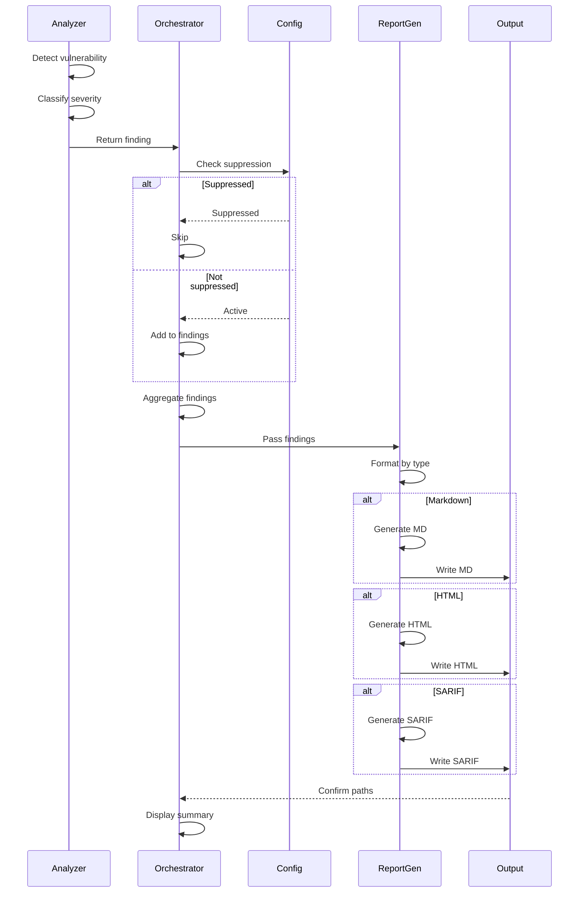

### Finding Data Structure

```python
@dataclass
class Finding:
    rule_id: str           # Unique identifier (e.g., "reentrancy-eth")
    severity: str          # CRITICAL, HIGH, MEDIUM, LOW, INFO
    category: str          # Heuristic, Slither, Aderyn, etc.
    title: str             # Human-readable title
    description: str       # Detailed description
    file: str             # Source file path
    line_no: int          # Line number
    code_snippet: str     # Affected code
    remediation: str       # Fix suggestion (optional)
```

### Suppression Matching Logic

1. **Rule ID Match**: Finding's rule_id must match suppression rule_id
2. **File Match** (optional): If suppression specifies file, exact or path match required
3. **Line Match** (optional): If suppression specifies line, exact line number required
4. **Expiration Check**: If suppression has expires date, must not be past due

---

## 8. Innovative Features Architecture

This section details how the 7 innovative features integrate with the core Counterscarp Engine architecture.

### 8.1 AI Audit Copilot (RAG System)

The RAG-based knowledge system enriches findings with contextual explanations from historical audit data.

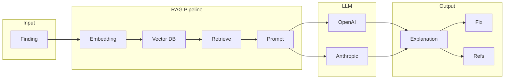

**Key Components:**
- `rag_engine.py` - Main RAG orchestrator
- `embeddings.py` - Text embedding generation (local + API)
- Vector store for historical audit embeddings
- Prompt templates for vulnerability explanation

---

### 8.2 Attack Path Visualizer

Generates interactive force-directed graphs showing cross-contract vulnerability chains.

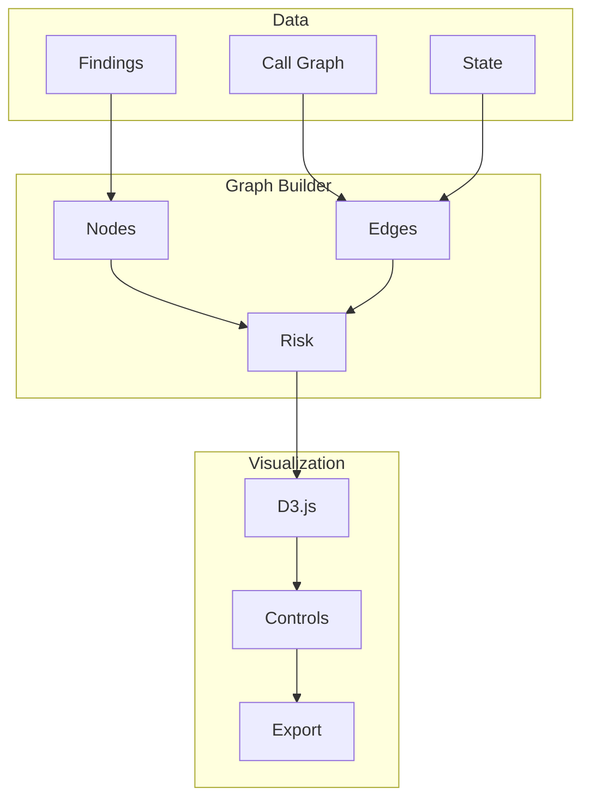

---

### 8.3 Time-Travel Scanner

Git-based historical analysis for tracking when vulnerabilities were introduced.

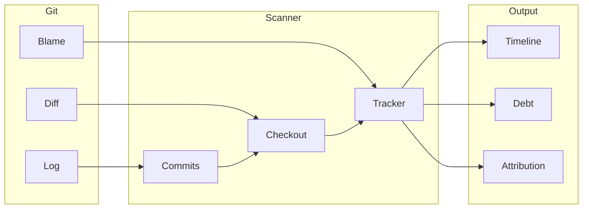

---

### 8.4 Anchor IDL Validator

Solana-specific IDL validation for Anchor programs.

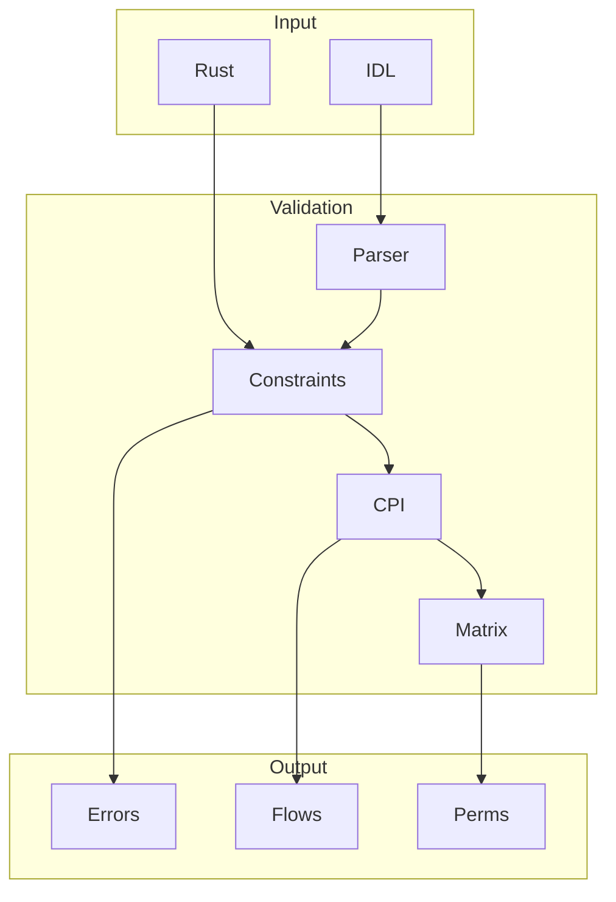

---

### 8.5 CI/CD Pipeline Generator

Multi-platform pipeline generation for security automation.

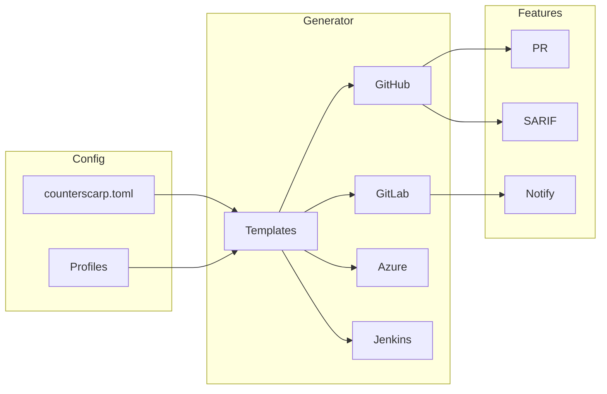

---

### 8.6 Enhanced Exploit Generator

Pattern-to-template exploit generation with multi-LLM support.

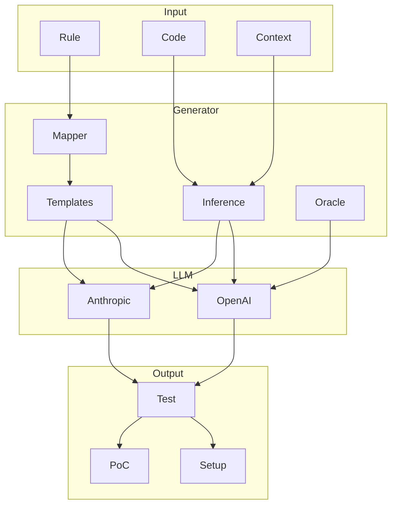

---

### 8.7 Protocol Fingerprint Scanner

Protocol similarity detection and inherited vulnerability analysis.

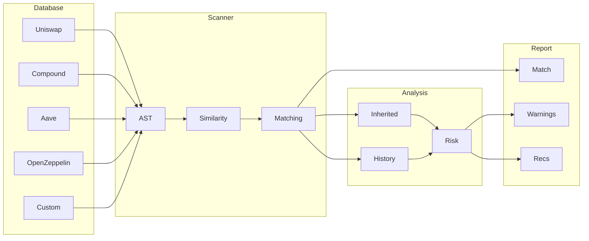

---

## 9. v5.0.3 API Security Architecture

This section documents the security hardening layer introduced in v5.0.2 for the web application API (`webapp/`).

### 9.1 Rate Limiting

The web app uses a **thread-safe in-memory sliding window** rate limiter (`webapp/rate_limiter.py`) with per-IP tracking. Each incoming request's client IP is extracted from the `X-Forwarded-For` header (with fallback to the direct connection IP). A rolling window of timestamps is maintained per IP per endpoint bucket; requests exceeding the limit within the window receive an immediate `HTTP 429 Too Many Requests` response.

| Endpoint | Limit | Window |
|----------|-------|--------|
| `/api/validate-license` | 10 req | 60 s |
| `/api/deactivate-license` | 5 req | 60 s |
| `/api/webhook` (Stripe) | 30 req | 60 s |

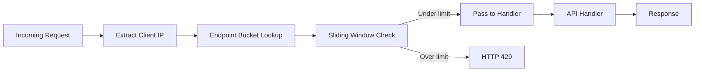

**Key design properties:**
- Window state is held in a `threading.Lock`-protected `defaultdict`; no Redis dependency required.
- Expired timestamps are pruned on each check to bound memory growth.
- Rate-limit state is cleared on application startup via a startup hook (also clears stale `reports/` and `uploads/` directories).

### 9.2 Input Validation Layer

All API request bodies are modelled with **Pydantic v2** using `StringConstraints` to enforce length and pattern rules before business logic executes. This prevents oversized payloads, injection via abnormally long strings, and missing-field errors reaching the engine core.

Examples of enforced constraints:

| Field | Constraint |
|-------|-----------|
| License key | `max_length=128`, `strip_whitespace=True` |
| Project name | `max_length=64`, regex `[A-Za-z0-9_\-]+` |
| File path inputs | `max_length=512` |
| Webhook payload | validated against Stripe signature before deserialization |

### 9.3 Security Event Logging

All security-relevant events are emitted to the dedicated **`counterscarp.security`** logger (a child of the root `counterscarp` logger). This logger writes to both the standard structured log stream and, in production, to the systemd journal under the `counterscarp-engine` unit, from where `logrotate-counterscarp` manages rotation.

Events captured include:

- Rate-limit hits (IP, endpoint, window count)
- License validation failures and grace-period activations
- Stripe webhook signature verification failures
- Startup cleanup actions (files removed, directories reset)

### 9.4 Startup Cleanup Automation

On every application startup the web server registers an async startup hook that:

1. Removes scan artefacts older than 24 h from `uploads/` and `results/`
2. Truncates orphaned per-session `reports/` subdirectories with no associated scan record
3. Resets in-memory rate-limit state (ensures a clean slate after a restart/redeploy)

This prevents unbounded disk growth on long-running VPS deployments without requiring a separate cron job.

---

## Appendix: Module Reference

| Module | Purpose | Key Classes/Functions |
|--------|---------|----------------------|
| `orchestrator.py` | CLI entry point, pipeline controller | `main()`, `generate_markdown_report()` |
| `red_team_scan.py` | Slither integration | `run_slither()`, `filter_vulnerabilities()` |
| `heuristic_scanner.py` | Pattern-based analysis | `scan_target()`, `HeuristicFinding` |
| `fuzz_wrapper.py` | Foundry fuzzing | `run_foundry_fuzz()`, `parse_counterexamples()` |
| `symbolic_wrapper.py` | Mythril integration | `run_mythril()`, `parse_issues()` |
| `aderyn_wrapper.py` | Aderyn integration | `run_aderyn()` |
| `medusa_wrapper.py` | Medusa fuzzing | `run_medusa_fuzz()` |
| `solana_analyzer.py` | Solana/Anchor analysis | `analyze_solana_program()` |
| `upgrade_diff.py` | Upgrade safety | `analyze_upgrade()` |
| `supply_chain_check.py` | Dependency scanning | `scan_package_json()` |
| `knowledge_fetcher.py` | Threat intelligence | Fetch from C4, Immunefi, Solodit |
| `solana_intel.py` | Solana-specific intel | Fetch from Neodyme, OtterSec, Sec3 |
| `report_generator.py` | Professional reports | `create_audit_report()`, `Finding` |
| `config_loader.py` | Configuration management | `load_config()`, `CounterscarfConfig` |
| `logger.py` | Structured logging | `get_logger()` |
| `exceptions.py` | Custom exceptions | `CounterscarfError` hierarchy |
| `http_utils.py` | Resilient HTTP client | Retry, backoff, rate limiting |
| `gui.py` | Tkinter GUI interface | GUI application |
| `intent_check.py` | Liar Detector | NatSpec validation |
| `access_matrix.py` | Access control analysis | Permission mapping |
| `exploit_generator.py` | AI PoC generation | Exploit templates |
| `inflation_scaffold.py` | Tokenomics analysis | Inflation detection |
| `threat_intel.py` | Core threat intel | Intelligence aggregation |
| `rag_engine.py` | RAG knowledge retrieval | `query_knowledge_base()`, `enrich_finding()` |
| `embeddings.py` | Text embeddings | `generate_embedding()`, `EmbeddingCache` |
| `attack_graph.py` | Attack path construction | `build_attack_graph()`, `find_attack_paths()` |
| `visualizer.py` | Interactive visualization | `generate_d3_graph()`, `export_mermaid()` |
| `history_scanner.py` | Git history analysis | `scan_history()`, `blame_vulnerability()` |
| `idl_validator.py` | Anchor IDL validation | `validate_idl()`, `trace_cpi_flows()` |
| `pipeline_generator.py` | CI/CD pipeline gen | `generate_github_actions()`, `generate_gitlab_ci()` |
| `fingerprint_scanner.py` | Protocol similarity | `fingerprint_contract()`, `find_inherited_vulns()` |
| `protocol_db.py` | Protocol fingerprint DB | `ProtocolFingerprint`, `SimilarityEngine` |
| `webapp/rate_limiter.py` | Thread-safe sliding window rate limiter for API endpoints. Enforces per-IP request limits on license validation (10/min), deactivation (5/min), and webhook (30/min) endpoints. | `RateLimiter`, `check_rate_limit()` |
| `deploy/logrotate-counterscarp` | System-level log rotation configuration for production deployments. Daily rotation, 7 rotations, compressed. | *(config file — no classes)* |
